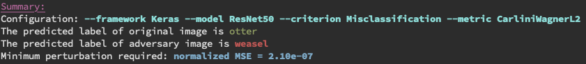

# Perceptron Robustness Benchmark
Perceptron is a robustness benchmark for computer vision DNN models. It
supports both image classification and object detection models on PyTorch,
Tensorflow, Keras, PaddlePaddle (in progress), as well as cloud APIs. Perceptron inherits the
design from [`foolbox`](https://github.com/bethgelab/foolbox), and is designed to be agnostic to
the deep learning frameworks the models are built on.

Documentation is available on [`readthedoc`](https://perceptron-robustness-benchmark.readthedocs.io/)

Currently, you can use Perceptron either through its python API or its command line tool.

## Getting Started

### Running Examples via Command Lines
In the docker shell, run the test through Perceptron command line interface
```bash
python perceptron/launcher.py \
    --framework keras \
    --model resnet50 \
    --criteria misclassification\
    --metric carlini_wagner_l2 \
    --image example.png
```

In above command line, the user lets the framework as ``keras``, the model as
``resnet50``, the criterion as ``misclassification`` (i.e., we want to generate
an adversary which is similar to the original image but has different predicted
label), the metric as ``carlini_wagner_l2``, the input image as
``example.png``.

The output of above command line is as follows.



To has a better visualization of the adversary, we also provide the plot of the
original image, adversary image, and their difference as follows.


You can try different combinations of frameworks, models, criteria, and
metrics. To see more options using `-h` for help message.
```
python perceptron/launcher.py -h
```

### Docker Quick Start
Build the docker image and all dependencies will be installed automatically.
```
nvidia-docker build -t perceptron:env .
```

### Keras: ResNet50 - C&W2 Benchmarking
The following example serves the same purpose as the command line example.
This example benchmarks the robustness of Keras ResNet50 model against `C&W2`
metric by measuring the minimal required :math:`L2` perturbation for a `CW2` to
success. The minimum Mean Squred Distance (MSE) will be logged.

```python
import numpy as np
import keras.applications as models
from perceptron.models.classification.keras import KerasModel
from perceptron.utils.image import imagenet_example
from perceptron.benchmarks.carlini_wagner import CarliniWagnerL2Metric
from perceptron.utils.criteria.classification import Misclassification

# instantiate the model from keras applications
resnet50 = models.ResNet50(weights='imagenet')

# initialize the KerasModel
# keras resnet50 has input bound (0, 255)
preprocessing = (np.array([104, 116, 123]), 1)  # the mean and stv of the whole dataset
kmodel = KerasModel(resnet50, bounds=(0, 255), preprocessing=preprocessing)

# get source image and label
# the model expects values in [0, 255], and channles_last
image, _ = imagenet_example(data_format='channels_last')
label = np.argmax(kmodel.predictions(image))

metric = CarliniWagnerL2Metric(kmodel, criterion=Misclassification())

adversary = metric(image, label, unpack=False)
```

Running the example will give you the minimal MSE required for `C&W2` to fool `resnet50` model (i.e., changing the predicted label).

## Acknowledgements
Perceptron Robustness Benchmark would not have been possible without the `foolbox` projects authored by [@Jonas](https://github.com/jonasrauber) and [@Wieland](https://github.com/wielandbrendel). Thanks for the code and inspiration!

## Contributing

You are welcome to send pull requests and report issues on GitHub or iCode. Note that the Perceptron Benchmark project follows the Git flow development model.

## Authors
* Yunhan Jia <jiayunhan@baidu.com>
* Yantao Lu <yantaolu@baidu.com>
* Xiaowei Chen <xiaoweichen01@baidu.com>

## Steering Committee

  - Tao Wei

## License
Perceptron Robustness Benchmark is provided under Apache-2.0 license. For a copy, see LICENSE file. 
