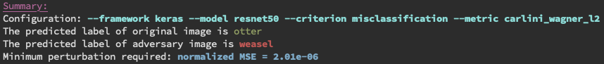
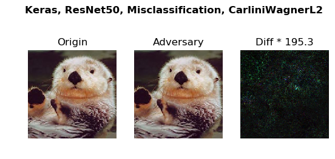
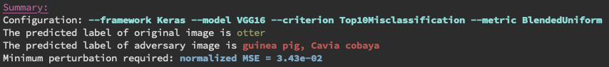
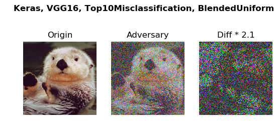
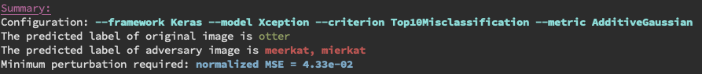
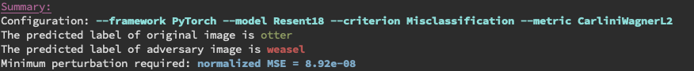
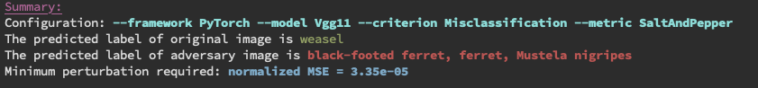
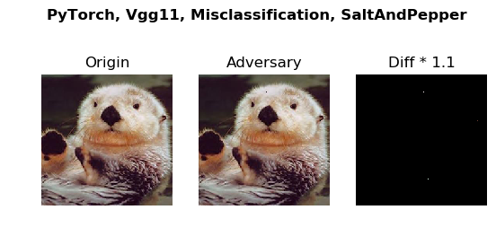
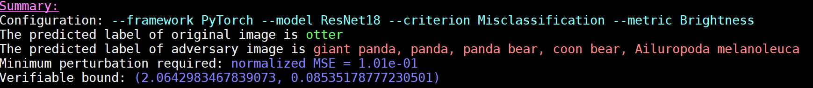
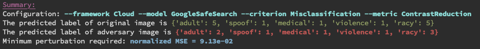

========
Examples
========

Here you can find a collection of examples.

Keras Framework
===============

Keras: ResNet50 - C&W2 Benchmarking 
-----------------------------------
This example benchmarks the robustness of ResNet50 model against :math:`C\&W_2`
attack by measuring the minimal required :math:`L_\infty`  perturbation for a
:math:`C\&W_2` attack to success.  You can find the example in the file
`example/keras_cw_example.py`. Run the example with command `python
example/keras_cw_example.py`
 
.. code-block:: python

        from __future__ import absolute_import
        
        import numpy as np
        import keras.applications as models
        from perceptron.models.classification.keras import KerasModel
        from perceptron.utils.image import imagenet_example
        from perceptron.benchmarks.carlini_wagner import CarliniWagnerL2Metric
        from perceptron.utils.criteria.classification import Misclassification
        
        # instantiate the model from keras applications
        resnet50 = models.ResNet50(weights='imagenet')
        
        # initialize the KerasModel
        preprocessing = (np.array([104, 116, 123]), 1)  # the mean and stv of the whole dataset
        kmodel = KerasModel(resnet50, bounds=(0, 255), preprocessing=preprocessing)
        
        # get source image and label
        # the model expects values in [0, 255], and channles_last
        image, _ = imagenet_example(data_format='channels_last')
        label = np.argmax(kmodel.predictions(image))
        metric = CarliniWagnerL2Metric(kmodel, criterion=Misclassification())
        adversary = metric(image, label, unpack=False)

By running the file `examples/keras_cw_example.py`, you will get the following output:

The command line tool `perceptron/launcher.py` provide users a way to play different combinations of
frameworks and models without writing code. For example, the following command line serves the same purpose
as above example.

.. code-block:: bash

        python perceptron/launcher.py \
                --framework keras \
                --model resnet50 \
                --criteria misclassification \
                --metric carlini_wagner_l2 \
                --image example.png

Keras: YOLOv3 - C&W2 Benchmarking (Object detection)
----------------------------------------------------
This example benchmarks the robustness of YOLOv3 model (the state-of-the-art
object detection model) against :math:`C\&W_2` attack by measuring the minimal
required :math:`L_\infty`  perturbation for a :math:`C\&W_2` attack to success.
The minimum Mean Squred Distance (MSE) will be logged. You can find the example
in the file `example/keras_cw_yolo_example.py`. Run the example with command
`python example/keras_cw_yolo_example.py`
        
.. code-block:: python3

        from perceptron.zoo.yolov3.model import YOLOv3
        from perceptron.models.detection.keras_yolov3 import KerasYOLOv3Model
        from perceptron.utils.image import load_image
        from perceptron.benchmarks.carlini_wagner import CarliniWagnerLinfMetric
        from perceptron.utils.criteria.detection import TargetClassMiss
        
        # instantiate the model from keras applications
        yolov3 = YOLOv3()
        
        # initialize the KerasYOLOv3Model
        kmodel = KerasYOLOv3Model(yolov3, bounds=(0, 1))
        
        # get source image and label
        # the model expects values in [0, 1], and channles_last
        image = load_image(shape=(416, 416), bounds=(0, 1), fname='car.png')
        metric = CarliniWagnerLinfMetric(kmodel, criterion=TargetClassMiss(2))
        adversary = metric(image, binary_search_steps=1, unpack=False)

The object detection results for the original image and the adversarial one is shown as follows. 

.. figure:: ../images/Keras_YoLoV3_TargetClassMiss_CarliniWagnerLINF.png

In the following, we provide a command line which serves the same purpose as above piece of code. 

.. code-block:: bash

        python perceptron/launcher.py \
                --framework keras \
                --model yolo_v3 \
                --criteria target_class_miss --target_class 2 \
                --metric carlini_wagner_linf \
                --image car.png

The command line tool `perceptron/launcher.py` allows users to try different
combinations of framework, model, criteria, metric and image without writing
detailed code. In the following, we provide more API examples and their
corresponding command lines.

Keras: VGG16 - Blended Uniform Noise
------------------------------------
In this example, we try different model and metric. Besides, we choose `TopKMisclassification`. The :math:`K` equals
to 10 in this example. It means we want to generate an adversary whose predicted label is not among the
top 10 highest possible predictions.

.. code-block:: python

        import numpy as np
        import keras.applications as models
        from perceptron.models.classification.keras import KerasModel
        from perceptron.utils.image import imagenet_example
        from perceptron.benchmarks.blended_noise import BlendedUniformNoiseMetric
        from perceptron.utils.criteria.classification import TopKMisclassification
        
        # instantiate the model from keras applications
        vgg16 = models.VGG16(weights='imagenet')
        
        # initialize the KerasModel
        # keras vgg16 has input bound (0, 255)
        preprocessing = (np.array([104, 116, 123]), 1)  # the mean and stv of the whole dataset
        kmodel = KerasModel(vgg16, bounds=(0, 255), preprocessing=preprocessing)
        
        # get source image and label
        # the model expects values in [0, 255], and channles_last
        image, _ = imagenet_example(data_format='channels_last')
        label = np.argmax(kmodel.predictions(image))
        metric = BlendedUniformNoiseMetric(kmodel, criterion=TopKMisclassification(10))
        adversary = metric(image, label, unpack=False, epsilons=100)  # choose 100 different epsilon values in [0, 1]

The corresponding command line is 

.. code-block:: bash

        python perceptron/launcher.py \   
                --framework keras \
                --model vgg16 \
                --criteria topk_misclassification \
                --metric blend_uniform_noise \
                --image example.png

By running the example file `examples/keras_bu_example.py`, you will get the output as follows.

Keras: Xception - Additive Gaussion Noise
-----------------------------------------
In this example, we show the performance of model `Xception` under the metric `Additive Gaussian Noise`.

.. code-block:: python3

        import numpy as np
        import keras.applications as models
        from perceptron.models.classification.keras import KerasModel
        from perceptron.utils.image import imagenet_example
        from perceptron.benchmarks.additive_noise import AdditiveGaussianNoiseMetric
        from perceptron.utils.criteria.classification import TopKMisclassification
        
        # instantiate the model from keras applications
        xception = models.Xception(weights='imagenet')
        
        # initialize the KerasModel
        # keras xception has input bound (0, 1)
        mean = np.array([0.485, 0.456, 0.406]).reshape((1, 1, 3))
        std = np.array([0.229, 0.224, 0.225]).reshape((1, 1, 3))
        kmodel = KerasModel(xception, bounds=(0, 1), preprocessing=(mean, std))
        
        # get source image and label
        # the model Xception expects values in [0, 1] with shape (299, 299), and channles_last
        image, _ = imagenet_example(shape=(299, 299), data_format='channels_last')
        image /= 255.0
        label = np.argmax(kmodel.predictions(image))
        metric = AdditiveGaussianNoiseMetric(kmodel, criterion=TopKMisclassification(10))
        adversary = metric(image, label, unpack=False, epsilons=1000)  # choose 1000 different epsilon values in [0, 1]

The corresponding command line is:

.. code-block:: bash

        python perceptron/launcher.py \
                --framework keras \
                --model xception \
                --criteria topk_misclassification \
                --metric additive_gaussian_noise \
                --image example.png

By runnig the corresponding example file `examples/keras_ag_example.py`, you will get the following output.
 

.. figure:: ../images/Keras_Xception_Top10Misclassification_AdditiveGaussian.png

PyTorch Framework
=================
Note: for the pytorch model, the range of the input image is always in :math:`[0, 1]`.

PyTorch: ResNet18 - C&W Benchmarking
------------------------------------
This example verifies the robustness of ResNet18 model against :math:`C\&W_2` by
measuring the required :math:`L_2` pertubutation for a :math:`C\&W_2` attack to success. The
example with more details can be found in the file
`example/torch_cw_example.py`.

.. code-block:: python

        import torch
        import torchvision.models as models
        import numpy as np
        from perceptron.models.classification.pytorch import PyTorchModel
        from perceptron.utils.image import imagenet_example
        from perceptron.benchmarks.carlini_wagner import CarliniWagnerL2Metric
        from perceptron.utils.criteria.classification import Misclassification
        
        # instantiate the model
        resnet18 = models.resnet18(pretrained=True).eval()
        if torch.cuda.is_available():
            resnet18 = resnet18.cuda()
        
        # initialize the PyTorchModel
        mean = np.array([0.485, 0.456, 0.406]).reshape((3, 1, 1))
        std = np.array([0.229, 0.224, 0.225]).reshape((3, 1, 1))
        fmodel = PyTorchModel(
            resnet18, bounds=(0, 1), num_classes=1000, preprocessing=(mean, std))
        
        # get source image and label
        image, label = imagenet_example(data_format='channels_first')
        image = image / 255.  # because our model expects values in [0, 1]
        metric = CarliniWagnerL2Metric(fmodel, criterion=Misclassification())
        adversary = metric(image, label, unpack=False)

The corresponding command line is 

.. code-block:: bash

        python perceptron/launcher.py \
                --framework pytorch \
                --model resnet18 \
                --criteria misclassification \
                --metric carlini_wagner_l2 \
                --image example.png

By running the example file `example/torch_cw_example.py`, you will get the following output.

.. figure:: ../images/PyTorch_Resent18_Misclassification_CarliniWagnerL2.png

Above example shows that it is easy to fool a well-tuned classifier by adding small pertubation to the target.

PyTorch: VGG11 - SaltAndPepper Noise
------------------------------------
In this example, we choose a different model and metric from above example. The detailed example file is at 
`examples/torch_sp_example.py`

.. code-block:: python

        from __future__ import absolute_import
        import torch
        import torchvision.models as models
        import numpy as np
        from perceptron.models.classification.pytorch import PyTorchModel
        from perceptron.utils.image import imagenet_example
        from perceptron.benchmarks.salt_pepper import SaltAndPepperNoiseMetric
        from perceptron.utils.criteria.classification import Misclassification
        
        # instantiate the model
        vgg11 = models.vgg11(pretrained=True).eval()
        if torch.cuda.is_available():
            vgg11 = vgg11.cuda()
        
        # initialize the PyTorchModel
        mean = np.array([0.485, 0.456, 0.406]).reshape((3, 1, 1))
        std = np.array([0.229, 0.224, 0.225]).reshape((3, 1, 1))
        fmodel = PyTorchModel(
            vgg11, bounds=(0, 1), num_classes=1000, preprocessing=(mean, std))
        
        # get source image 
        image, _ = imagenet_example(data_format='channels_first')
        image = image / 255.  # because our model expects values in [0, 1]
        
        # set the label as the predicted one
        true_label = np.argmax(fmodel.predictions(image))
        # set the type of noise which will used to generate the adversarial examples
        metric = SaltAndPepperNoiseMetric(fmodel, criterion=Misclassification())
        adversary = metric(image, true_label, unpack=False) # set 'unpack' as false so we can access the detailed info of adversary

The corresponding command line is 

.. code-block:: bash

        python perceptron/launcher.py \ 
                --framework pytorch \ 
                --model vgg11 \
                --criteria misclassification \
                --metric salt_and_pepper_noise \
                --image example.png 

By running the example file `example/torch_sp_example.py`, you will get the following output:

The model `VGG11` does not produce the correct prediction at the beginning. By revising only two pixels, we are able
to fool the classifier to make another wrong prediction.

PyTorch: ResNet18 - Brightness Verification
-------------------------------------------
This example verifies the robustness of ResNet18 model against brightness
variations, and it will give a verifiable bound. The detailed example file is
at `examples/torch_br_example.py`

.. code-block:: python3

        from __future__ import absolute_import
        
        import torch
        import torchvision.models as models
        import numpy as np
        from perceptron.models.classification.pytorch import PyTorchModel
        from perceptron.utils.image import imagenet_example
        from perceptron.benchmarks.brightness import BrightnessMetric
        from perceptron.utils.criteria.classification import Misclassification
        
        # instantiate the model
        resnet18 = models.resnet18(pretrained=True).eval()
        if torch.cuda.is_available():
            resnet18 = resnet18.cuda()

        # initialize the PyTorchModel
        mean = np.array([0.485, 0.456, 0.406]).reshape((3, 1, 1))
        std = np.array([0.229, 0.224, 0.225]).reshape((3, 1, 1))
        fmodel = PyTorchModel(
            resnet18, bounds=(0, 1), num_classes=1000, preprocessing=(mean, std))

        # get source image and print the predicted label
        image, _ = imagenet_example(data_format='channels_first')
        image = image / 255.  # because our model expects values in [0, 1]

        # set the type of noise which will used to generate the adversarial examples
        metric = BrightnessMetric(fmodel, criterion=Misclassification())

        # set the label as the predicted one
        label = np.argmax(fmodel.predictions(image))

        adversary = metric(image, label, unpack=False, verify=True)  # set 'unpack' as false so we can access the detailed info of adversary

The corresponding command line is 

.. code-block:: bash

        python perceptron/launcher.py \
                --framework pytorch \
                --model resnet18 \
                --criteria misclassification \
                --metric brightness --verify\
                --image example.png

By running the example file `example/torch_sp_example.py`, you will get the following output:

.. figure:: ../images/pytorch_resnet18_misclassification_brightness.png

In above figure, we only show the adversarial exampe when we increase the
brightness.  Let :math:`(L, U)` denotes the verifiable bound.  The value
:math:`(L)` (resp. :math:`U`) means if we want to increase (resp. decrease)
the brightness to generate adversary example, the minimal brightness
pertubation we need is  :math:`(L)` (resp. :math:`U`).  (Note: brightness
pertubation :math:`L` means multiplying each pixel in the image with value
:math:`L`)

Caution: when using the verifiable metric, if the parameter `verify` is not set
to `True`, the program will just slice the search space according to the
epsilon value, not the minimal step the verifiable metric requires.  Hence, the
output verifiable bound has a wider range than the actual verifiable bound.

Cloud Framework
===============

Cloud API: Google SafeSearch - Spatial Benchmarking
----------------------------------------------------
This example benchmarks the robustness of the SafeSearch API provided
by Google cloud AI platform against spatial transformation attacks by
attack by measuring the minimal required pixel-wise shift for a
spatial attack to success.

.. code-block:: python3

        from __future__ import absolute_import
        from perceptron.utils.image import imagenet_example, load_image
        from perceptron.models.classification.cloud import GoogleSafeSearchModel
        from perceptron.benchmarks.contrast_reduction import ContrastReductionMetric
        from perceptron.utils.criteria.classification import MisclassificationSafeSearch
        import numpy as np
        from perceptron.utils.tools import plot_image
        from perceptron.utils.tools import bcolors
        
        
        # before running the example, please set the variable GOOGLE_APPLICATION_CREDENTIALS as follows
        # export GOOGLE_APPLICATION_CREDENTIALS="[PATH]"
        # replace [PATH] with the file path of the JSON file that contains your service account key
        # For more details, please refer to https://cloud.google.com/docs/authentication/getting-started#auth-cloud-implicit-python
        
        model = GoogleSafeSearchModel()
        
        # get source image and label
        image = load_image(dtype=np.uint8, fname='porn.jpeg')
        metric = ContrastReductionMetric(model, criterion=MisclassificationSafeSearch())
        adversary = metric(image, epsilons=10, unpack=False)

The corresponding command line is 

.. code-block:: bash

        python perceptron/launcher.py \  
                --framework cloud \
                --model google_safesearch \
                --criteria misclassification_safesearch \
                --metric contrast_reduction \
                --image porn.jpeg

Run the corresponding example file `examples/safesearch_noise_example.py` The information printed on the screen is:

Note: For each cloud model, we have a specific criterion. Here the criterion
for `Google Safesearch` is `misclassification_safesearcha`. 
