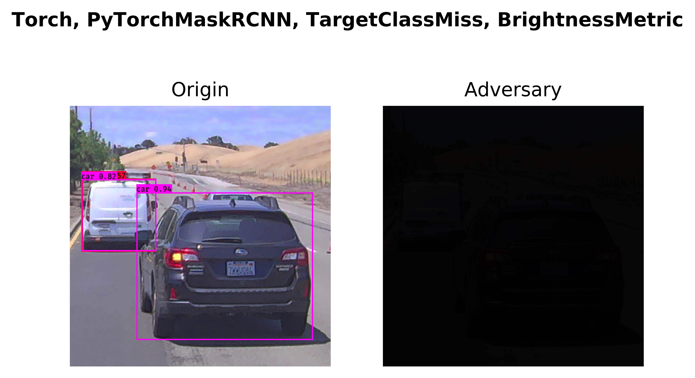

# Use Case 3 -- Prepare Mask RCNN Pytorch Model

The model we try to port is [Mask R-CNN backbone X101-64x4d-FPN](https://github.com/open-mmlab/mmdetection/tree/master/configs/mask_rcnn). This is an opensource project from OpenMMLab.


- Step 1 -- CLone perception robustness benchmark
```bash
git clone https://github.com/advboxes/perceptron-benchmark.git
cd perceptron-benchmark
nvidia-docker build -t perceptron:env ./
nvidia-docker run -i -t --rm -d --name perceptron perceptron:env bash
nvidia-docker exec -ti perceptron bash
```

- Step 2 -- Set up Mask R-CNN 

Install mmcv-full
```bash
pip install mmcv-full==1.0.5
```


Clone mmdetection repository
```bash
git clone https://github.com/open-mmlab/mmdetection.git
cd mmdetection
pip install -e .
```


Download model checkpoint
```bash
mkdir checkpoint
wget https://open-mmlab.s3.ap-northeast-2.amazonaws.com/mmdetection/v2.0/mask_rcnn/mask_rcnn_x101_64x4d_fpn_1x_coco/mask_rcnn_x101_64x4d_fpn_1x_coco_20200201-9352eb0d.pth
```


- Step 3 -- Make Mask R-CNN work with Perceptron Benchmark
```bash
cd /perceptron
cd perceptron/models/detection
```

Wrap your model by creating a sub-class of perceptron.models.base.DifferentiableModel and name it pytorch_mask_rcnn.py.
```python
"""PyTorch model wrapper for MaskRCNN object detection."""

from __future__ import absolute_import
import numpy as np
import logging
import os
from perceptron.models.base import DifferentiableModel
from perceptron.utils.criteria.detection import TargetClassMiss, RegionalTargetClassMiss
import torch

from mmdet.apis import inference_detector, init_detector, show_result_pyplot


class PyTorchMaskRCNNModel(DifferentiableModel):
    """Create a :class:`Model` instance from a `PyTorch` model.

    Parameters
    ----------
    bounds : tuple
        Tuple of lower and upper bound for the pixel values, usually
        (0, 1) or (0, 255).
    model_image_shape : tuple
        Tuple of the model input shape in format (height, width).
    channel_axis : int
        The index of the axis that represents color channels.
    num_classes : int
        Number of classes for which the model will output predictions.
    classes_path : str
        The path to the file containing class names.
    score : float
        The score threshold for considering a box as containing objects.
    iou : float
        The intersection over union (IoU) threshold.
    preprocessing: 2-element tuple with floats or numpy arrays
        Elementwises preprocessing of input; we first substract the first
        element of preprocessing from the input and then divide the input
        by the second element.

    """

    def __init__(
            self,
            bounds,
            model_image_shape=(416, 416),
            channel_axis=1,
            num_classes=80,
            classes_path="coco_classes.txt",
            score=0.3,
            iou=0.5,
            preprocessing=(0, 1)):


        super(PyTorchMaskRCNNModel, self).__init__(bounds=bounds,
                                               channel_axis=channel_axis,
                                               preprocessing=preprocessing)
        model_data_path = os.path.join(
                    os.path.dirname(__file__),
                    '../../zoo/yolov3/model_data/')

        self._task = 'det'
        self._model_image_shape = model_image_shape
        self._num_classes = num_classes
        #self._num_scales = num_scales
        #self._num_anchors = num_anchors
        self._classes_path = os.path.join(model_data_path, classes_path)
        #self._class_names = self.get_class()
        #self._anchors_path = os.path.join(model_data_path, anchors_path)
        #self._anchors = self._get_anchors()
        self._score = score
        self._iou = iou
        #self._max_boxes = max_boxes


        config = "/perceptron/mmdetection/configs/mask_rcnn/mask_rcnn_x101_64x4d_fpn_1x_coco.py"
        checkpoint = "/perceptron/mmdetection/checkpoint/mask_rcnn_x101_64x4d_fpn_1x_coco_20200201-9352eb0d.pth"

        self._model = init_detector(config, checkpoint, 'cpu')


    def get_class(self):
        classes_path = os.path.expanduser(self._classes_path)
        with open(classes_path) as f:
            class_names = f.readlines()
        class_names = [c.strip() for c in class_names]
        return class_names

    def num_classes(self):
        """Return the number of classes."""
        return self._num_classes

    def class_names(self):
        """Return the class names as list."""
        return self._class_names

    def model_task(self):
        """Return the task of the model: classification of detection."""
        return self._task

    def batch_predictions(self, images):
        """Batch prediction of images.

        Parameters
        ----------
        images : `numpy.ndarray`
            The input image in [b, h, n, c] ndarry format.

        Returns
        -------
        list
            List of batch prediction resutls.
            Each element is a dictionary containing:
            {'boxes', 'scores', 'classes}
        """
        px, _ = self._process_input(images)

        px = px[0]
        results = inference_detector(self._model, px)
        predictions = []

        bbox_results, segm_results = results
        bboxes = np.vstack(bbox_results)
        labels = [
                    np.full(bbox.shape[0], j, dtype=np.int32)
                    for j, bbox in enumerate(bbox_results)
                    ]

        labels = np.concatenate(labels)

        bboxes = np.append(bboxes, np.transpose([labels]), axis=1)


        bbox_results = bboxes[bboxes[:,4] > self._score]

        splits = np.hsplit(bbox_results, np.array([4,5]))


        if len(splits[1]) > 0:
            scores = np.concatenate(splits[1])
            pred = {}
            bboxes = splits[0] #top, left, bottom, right
            order = [1,0,3,2] # perceptron accepts bbox in the form of [left, top, right , bottom]
            idx = np.empty_like(order)
            idx[order] = np.arange(len(order))
            bboxes[:] = bboxes[:, idx]
            pred['boxes'] = bboxes
            pred['scores'] = scores
            pred['classes'] = np.concatenate(splits[2]).astype(np.int32)
            predictions.append(pred)


        return predictions


    def predictions_and_gradient(self, image, criterion):
        '''

        '''
        pass
    def backward(self, target_class, image):
        """Get gradient with respect to the image."""
        pass

```

Run test case torch_mask_rcnn.py
```bash
cd /perceptron
python examples/torch_mask_rcnn.py
```

The result shall look like
```bash
Process finished
Summary:
Configuration: --framework Torch --model PyTorchMaskRCNN --criterion TargetClassMiss --metric BrightnessMetric
Minimum perturbation required: normalized MSE = 2.88e-01
```

This test will aslo produce an image in /perceptron/examples/images/Torch_PyTorchMaskRCNN_TargetClassMiss_BrightnessMetric.png

