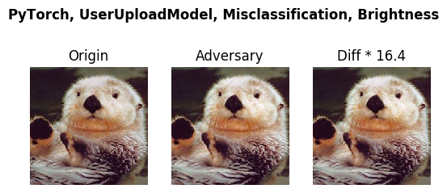

# Use Case 2 Prepare ResNext101_32x4d PyTorch Model

The model we try to port is [ResNext101_32x4d]([https://github.com/open-mmlab/mmclassification](https://github.com/open-mmlab/mmclassification)). This is an opensource project from 


- Step 1 -- Clone perceptron robustness benchmark
```bash
git clone https://github.com/advboxes/perceptron-benchmark.git
cd perceptron-benchmark
nvidia-docker build -t perceptron:env ./
nvidia-docker run -i -t --rm -d --name perceptron percetron:env bash
nvidia-docker exec -ti perceptron bash
```  

- Step 2 -- Set up ResNext101_32x4d

Install required dependencies, and apply patches to the source code to work with our preceptron benchmark.
```bash
pip install mmcv
git clone https://github.com/open-mmlab/mmclassification.git
cd mmclassification
git checkout -b 0fb9b2f
git apply /perceptron/userupload_usecases/mmcls.diff
pip install -e ./
```

Since the original mmclassifcation implementation doesn't have a callable method `forward(self, image)`, we added the method so that it can work with our perceptron benchmark tool. The following code snippet shows the difference.

```git
diff --git a/mmcls/models/classifiers/image.py b/mmcls/models/classifiers/image.py
index 436f2eb..279f8ce 100644
--- a/mmcls/models/classifiers/image.py
+++ b/mmcls/models/classifiers/image.py
@@ -39,6 +39,12 @@ class ImageClassifier(BaseClassifier):
             x = self.neck(x)
         return x

+    def forward(self, img):
+        x = self.extract_feat(img)
+        x = self.head.forward(x)
+        return x
+
+
     def forward_train(self, img, gt_label, **kwargs):
         """Forward computation during training.

diff --git a/mmcls/models/heads/linear_head.py b/mmcls/models/heads/linear_head.py
index 7d6c7c4..9d7571a 100644
--- a/mmcls/models/heads/linear_head.py
+++ b/mmcls/models/heads/linear_head.py
@@ -41,3 +41,6 @@ class LinearClsHead(ClsHead):
         cls_score = self.fc(x)
         losses = self.loss(cls_score, gt_label)
         return losses
+    def forward(self, x):
+        score = self.fc(x)
+        return score
```

Download the model weight file.
```bash
wget https://openmmlab.oss-accelerate.aliyuncs.com/mmclassification/v0/imagenet/resnext101_32x4d_batch256_20200708-87f2d1c9.pth
```


- Step 3 -- Make ResNext101_32x4d work with Perceptron Benchmark
```bash
cd -
cd perceptron/models/classification
```

Wrap your model by creating a sub-class of perceptron.models.classification.pytorch and name it pytorchmodelupload.py
```python
from __future__ import absolute_import

import torch
from perceptron.models.classification.pytorch import PyTorchModel


class PyModelUpload(PyTorchModel):
    def __init__(self,
                 bounds,
                 num_classes,
                 channel_axis=1,
                 device=None,
                 preprocessing=(0,1)):
        #load model
        model = self.load_model()
        if torch.cuda.is_available():
            model = model.cuda()

        model = model.eval()

        super(PyModelUpload, self).__init__(model = model,
                                            bounds=bounds,
                                            num_classes = num_classes,
                                            channel_axis = channel_axis,
                                            device=device,
                                            preprocessing=preprocessing)

    def load_model(self):
        '''
        model evaluation participants need to implement this and make sure a pytorch model can be loaded and fully-functional
        '''
        import mmcv
        from mmcls.models import build_classifier
        from mmcv.runner import get_dist_info, init_dist, load_checkpoint
        checkpoint = "/perceptron/mmclassification/resnext101_32x4d_batch256_20200708-87f2d1c9.pth"
        cfg = mmcv.Config.fromfile("/perceptron/mmclassification/configs/imagenet/resnext101_32x4d_batch256.py", checkpoint)
        cfg.model.pretrained = None
        cfg.data.test.test_mode = True
        model = build_classifier(cfg.model)
        _ = load_checkpoint(model, checkpoint, map_location = 'cpu')
        return model
```


Run test case pytorch_userupload.py
```bash
cd -
python examples/pytorch_userupload_br.py
```

The resuls shall look like 
```bash
Summary:
Configuration: --framework PyTorch --model UserUploadModel --criterion Misclassification --metric Brightness
The predicted label of original image is otter
The predicted label of adversary image is black-footed ferret, ferret, Mustela nigripes
Minimum perturbation required: normalized MSE = 9.59e-04
Verifiable bound: (1.0650057670123338, 0.24939638600404646)
```
This test will also produce an image in  /perceptron/examples/images/PyTorch_UserUploadModel_Misclassification_Brightness.png


